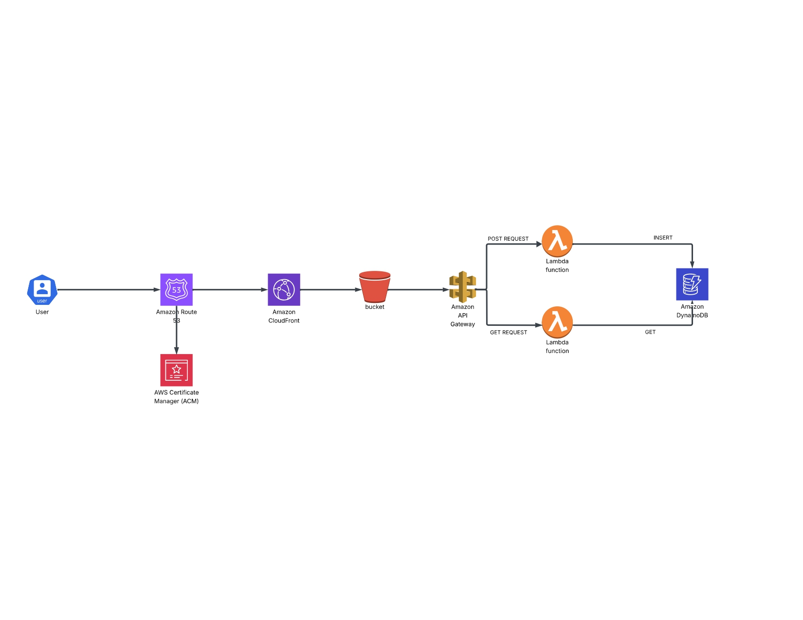

# 🚀 Deploying a Serverless Web Application on AWS

---

## 1. Architecture Diagram

> Replace the image below with your architecture diagram (PNG / SVG).  
> Use `images/architecture-diagram.png` or any raw GitHub URL.

**Project short description**  
This project demonstrates **serverless web hosting on AWS**, leveraging fully managed cloud services to build a scalable, cost-effective, and highly available web application without traditional server management.

- **Amazon Route 53** — Domain registration & DNS management to route traffic to the application.  
- **Amazon CloudFront** — Global CDN to deliver static and dynamic content with low latency.  
- **AWS Lambda** — Serverless compute for backend logic and APIs (no servers to manage).  
- **Amazon DynamoDB** — NoSQL database for fast, scalable data storage with automatic scaling.

---

## 2. Features

- ✅ Custom domain & DNS management with **Route 53**  
- ✅ Global content delivery using **CloudFront** (caching, HTTPS)  
- ✅ Serverless backend with **Lambda** (event-driven functions / API endpoints)  
- ✅ Persistent, low-latency storage with **DynamoDB**  
- ✅ Reduced operational overhead — fully managed services  
- ✅ Scalable and cost-optimized architecture  
- 🔧 Add any extra features you implemented (authentication, logging, monitoring, CI/CD, etc.)

---

## 3. Step-by-step Process

> There are 6 steps below. Replace each placeholder sentence with your own explanation and add the corresponding PNG to `images/step1.png`, `images/step2.png`, etc.

### Step 1 — [Step Title]
_Replace this line with your description for Step 1._  

---

### Step 2 — [Step Title]
_Replace this line with your description for Step 2._  

---

### Step 3 — [Step Title]
_Replace this line with your description for Step 3._  

---

### Step 4 — [Step Title]
_Replace this line with your description for Step 4._  

---

### Step 5 — [Step Title]
_Replace this line with your description for Step 5._  

---

### Step 6 — [Step Title]
_Replace this line with your description for Step 6._  

---

## Notes — Adding images to your repo

1. Create an `images/` folder at the root of your repo.  
2. Add your images with the exact file names used above (e.g., `architecture-diagram.png`, `step1.png`).  
3. Commit and push — GitHub will render them with the `` links.

---

## License
This project is licensed under the MIT License. See the [LICENSE](LICENSE) file for details.
