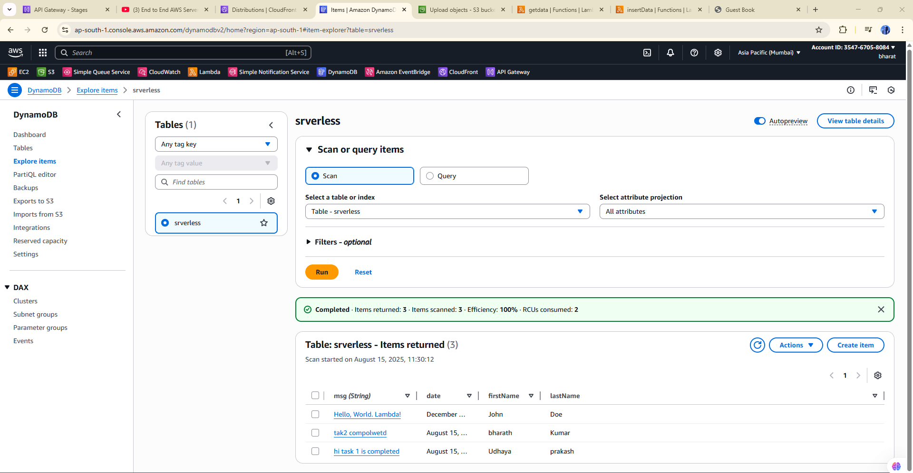
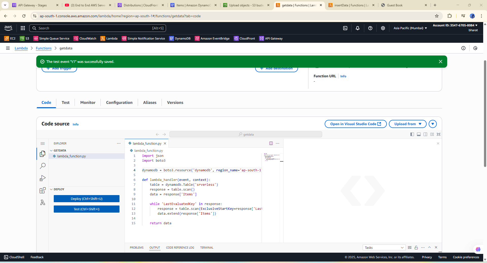
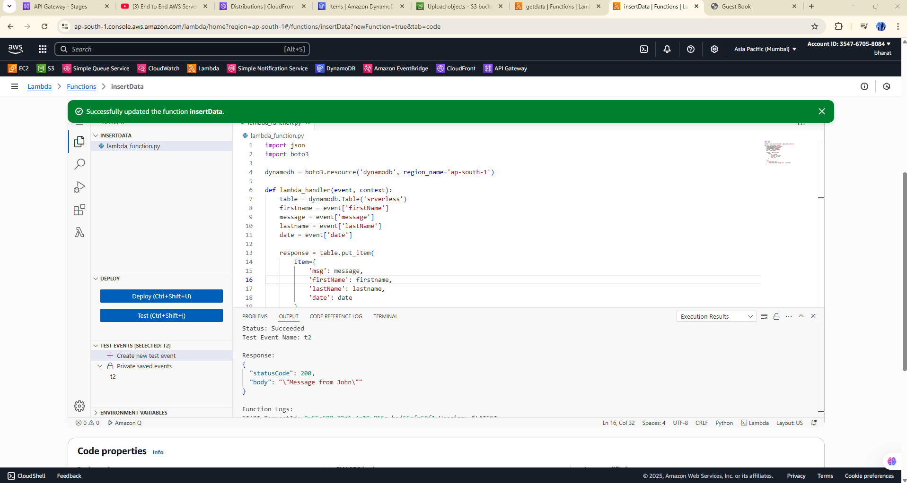
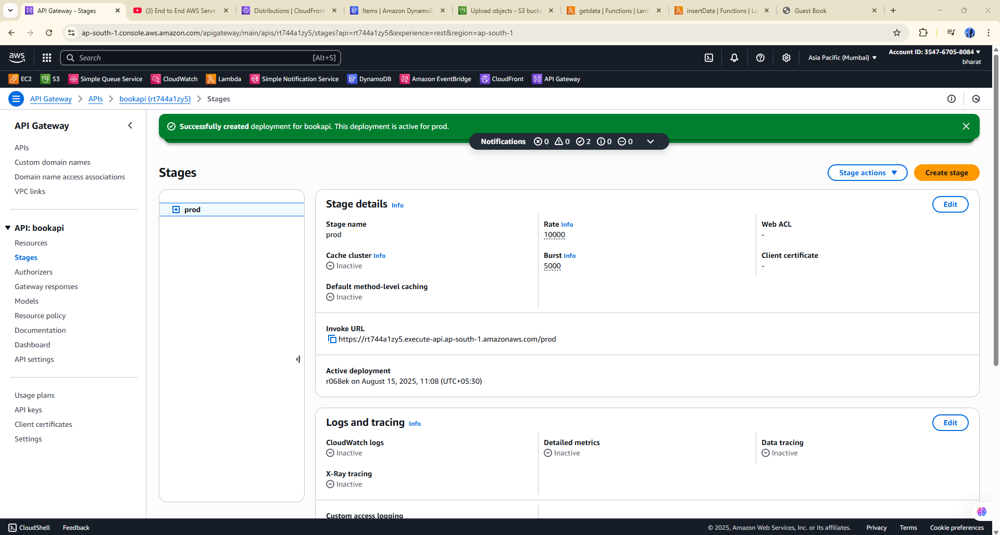
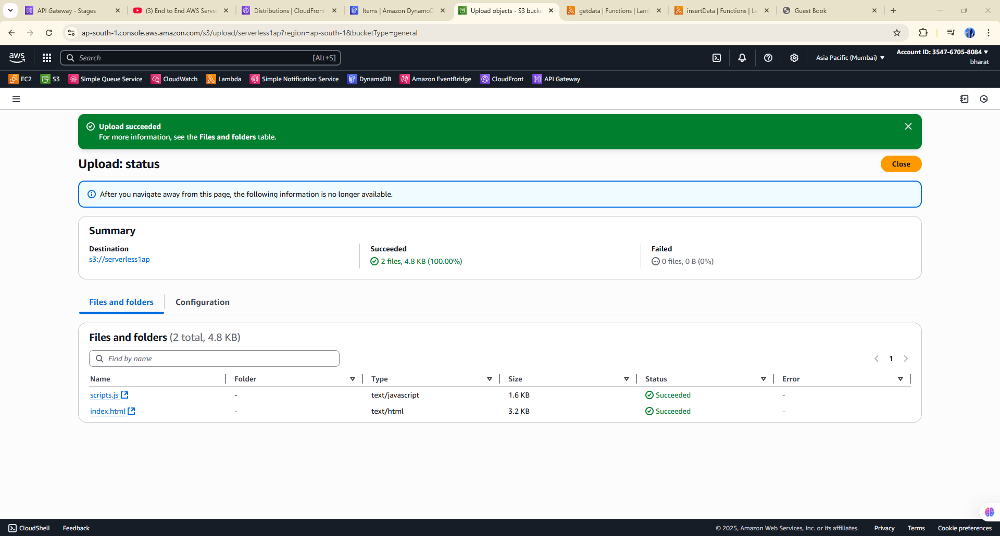
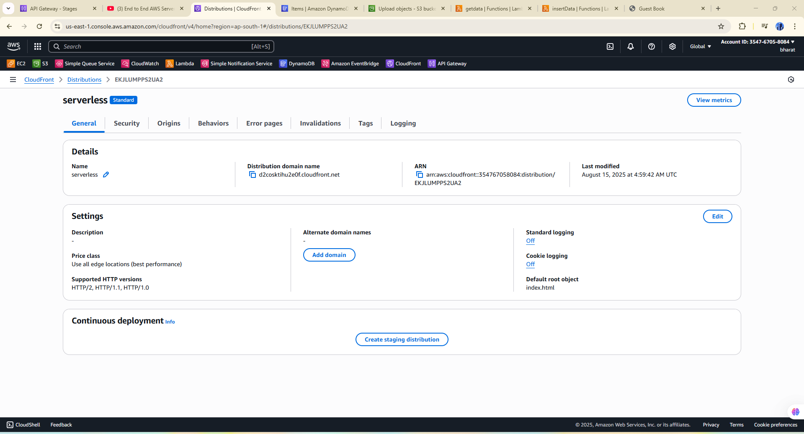

# 🚀 Deploying a Serverless Web Application on AWS

---

## 1. Architecture Diagram

**Project short description**  
This project demonstrates **serverless web hosting on AWS**, leveraging fully managed cloud services to build a scalable, cost-effective, and highly available web application without traditional server management.

- **Amazon Route 53** — Domain registration & DNS management to route traffic to the application.  
- **Amazon CloudFront** — Global CDN to deliver static and dynamic content with low latency.  
- **AWS Lambda** — Serverless compute for backend logic and APIs (no servers to manage).  
- **Amazon DynamoDB** — NoSQL database for fast, scalable data storage with automatic scaling.

---

## 2. Features

- ✅ Custom domain & DNS management with **Route 53**  
- ✅ Global content delivery using **CloudFront** (caching, HTTPS)  
- ✅ Serverless backend with **Lambda** (event-driven functions / API endpoints)  
- ✅ Persistent, low-latency storage with **DynamoDB**  
- ✅ Reduced operational overhead — fully managed services  
- ✅ Scalable and cost-optimized architecture  
- 🔧 Add any extra features you implemented (authentication, logging, monitoring, CI/CD, etc.)

---

## 3. Step-by-step Process

> There are 6 steps below. Replace each placeholder sentence with your own explanation and add the corresponding PNG to `images/step1.png`, `images/step2.png`, etc.

### Step 1 — [Prepare the Frontend]
- Create an HTML page with a form containing fields for name, email, and message and include "Save" and "View Messages" controls.
- Add JavaScript that sends a POST request to save contact details and a GET request to retrieve messages.
- Place a screenshot or wireframe showing the form and UI interaction.

---

### Step 2 — [Create DynamoDB Table]
- Open the AWS Console → DynamoDB → Create table.
- Table name: `Serverless`
- Primary key: `msg` (String)
- Use on-demand capacity mode for simplicity.  

---

### Step 3 — [Create Lambda Functions]
- **Create two Lambda functions:**
    - POST Lambda — receives form data and stores it in DynamoDB with a unique ID.
    - GET Lambda — retrieves saved contact entries from DynamoDB.
- Assign the Lambda execution role the necessary DynamoDB permissions and test using sample payloads.
- GET Lambda  

- POST Lambda  

---

### Step 4 — [Set Up API Gateway]
- Create an HTTP API in API Gateway.
- Create two routes:
   - POST /contacts → POST Lambda
   - GET /contacts → GET Lambda
- Enable CORS for your frontend origin (or * for testing), deploy the API, and copy the invoke URL(s).  

---

### Step 5 — [Deploy Frontend to S3]
- Create an S3 bucket (globally unique name).
- Enable static website hosting in the bucket properties.
- Upload the frontend files (`index.html`, `script.js`, and any assets).
- Configure public read (or use CloudFront). 

---

### Step 6 — [Create CloudFront Distribution]
- Create a CloudFront distribution using the S3 website or S3 origin.
- Set Default Root Object to `index.html`.
- Configure caching, HTTPS, and (optionally) an origin access identity.
- Use the CloudFront domain name as the public URL for the app (or map a custom domain)

---

## License
**FREE TO ACCESS THIS OPEN SOURCE PROJECT**
